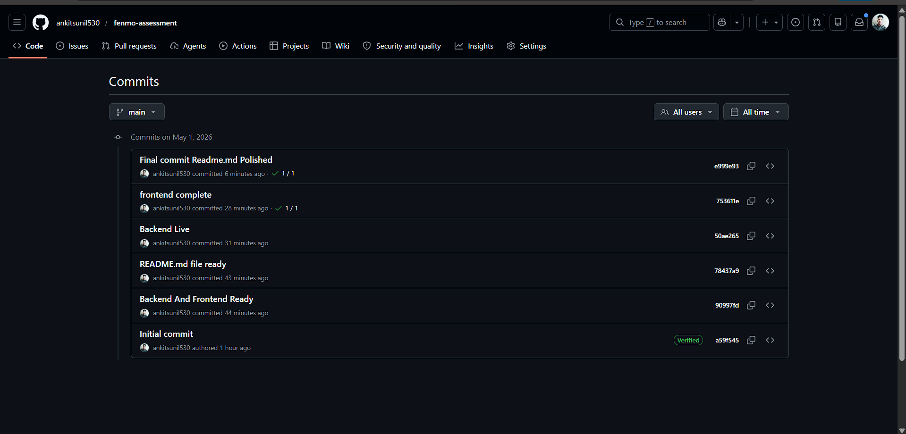
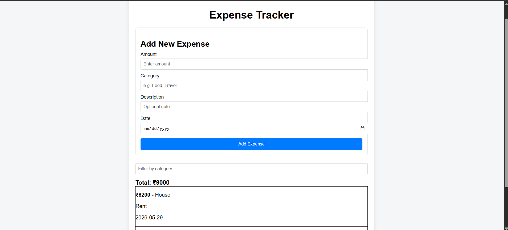

# 💰 Expense Tracker (Fenmo Assessment)

## 🚀 Live Demo

Frontend: https://fenmo-assessment-nu.vercel.app/
Backend: https://fenmo-backend-p4u7.onrender.com/

> ⚠️ Note: Backend is hosted on Render (free tier), so the first request may take ~30–60 seconds due to cold start.

---

## 🧩 Features

* Add new expense (amount, category, description, date)
* View all expenses
* Filter expenses by category
* Automatically sorted by newest date (latest first)
* Displays total of visible expenses
* Handles duplicate submissions safely (idempotent API)
* Provides user feedback for duplicate or successful submissions

---

## ⚙️ Tech Stack

* **Frontend:** React (Vite), Axios
* **Backend:** Node.js, Express
* **Storage:** In-memory data store (array)

---

## 🧠 Design Decisions

* **Idempotency Handling:**
  Implemented using:

  * Unique request IDs (UUID from frontend)
  * Payload comparison as a fallback
    This ensures safe retries (e.g., double-clicks, refresh, network retry)

* **Sorting Strategy:**
  Expenses are always sorted by date (newest first) on:

  * Backend (primary logic)
  * Frontend (extra safety layer)

* **Simplicity First Approach:**
  Focused on correctness, reliability, and edge-case handling instead of over-engineering UI

---

## ⚠️ Trade-offs

* Used **in-memory storage** instead of a database due to time constraints
* Data is **not persistent** (resets on server restart)
* Minimal UI to prioritize functionality over design

---

## 🧪 Edge Cases Handled

* Duplicate submissions (retry-safe API)
* Multiple rapid clicks on submit button
* Page refresh after submission
* Invalid inputs (e.g., negative amount)
* Empty state handling
* Loading states for better UX

---

## 🔮 Future Improvements

* Integrate persistent database (MongoDB / PostgreSQL)
* Add authentication & user-specific data
* Pagination for large datasets
* Improved UI/UX (toasts, animations)
* Add unit and integration tests

---

## 📸 Screenshots

### Commit History



### Application UI



---

## ▶️ Run Locally

### Backend

```bash
cd server
npm install
node index.js
```

### Frontend

```bash
cd client
npm install
npm run dev
```

---

## 📌 Summary

This project focuses on building a **reliable, production-like expense tracking system** that correctly handles real-world scenarios such as retries, duplicate submissions, and unstable network conditions.

Special emphasis was given to:

* Data correctness
* Idempotent API design
* Clean architecture
* Real-world robustness

---

## 🙌 Author

Sunil Kumar
GitHub: https://github.com/ankitsunil530
